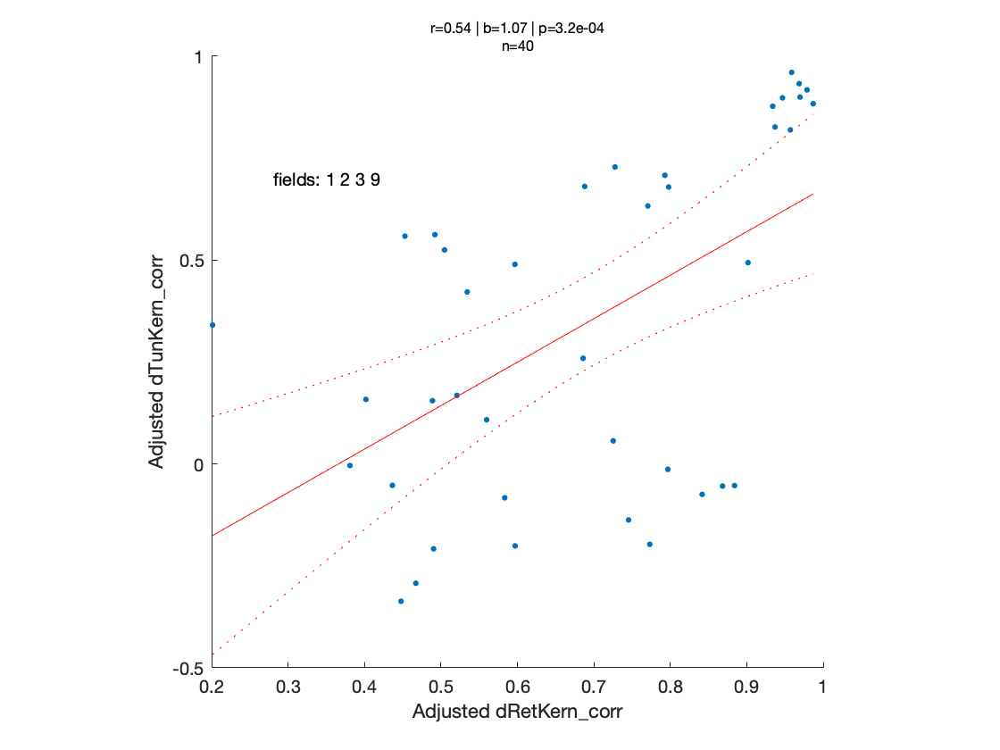

# LOCAL TUNING BIASES IN THE MOUSE dLGN

## Overview

The local regions of visual space are assessed by populations of visual neurons in the early visual system. The properties of these populations of cells is not well known. A classical idea posulates that groups of cells process each image region with a diverse set of filters tuned to all possible orientations (Hubel and Weisel 1963, 1969). 

A more recent, alternative idea is that groups neurons/units process a given image region with a similar, or biased, set of tuned filters ([Paik and Ringach 2011](https://www.nature.com/articles/nn.2824),  [Song et al 2020 ](https://www.cell.com/cell-reports/fulltext/S2211-1247(20)31570-9?_returnURL=https%3A%2F%2Flinkinghub.elsevier.com%2Fretrieve%2Fpii%2FS2211124720315709%3Fshowall%3Dtrue))

The aim of this project is to assess the presence of these 'local tuning biases' among populations of LGN afferents innervating mouse V1  (the thalamic axons that relay retinal signals to the cortex) . It is an extention of study conducted by [Jimenez et al 2018](https://journals.physiology.org/doi/full/10.1152/jn.00150.2018#:~:text=Local%20tuning%20biases%20imply%20that,assumed%20by%20modular%20cortical%20organization), who found evidence of local tuning biases in mouse primary visual cortex. 

To answer the question of whether tuning biases exist, one can estimate the spatial receptive fields and feature tuning of populations of thalamic boutons innervating mouse V1. Then, for each pair of boutons, determine the extent to which their receptive fields overlap and the similarity of their tuning profiles. If LGN boutons with overlapping receptive fields show similar tuning profiles, this would suggest the presence of local tuning biases.

<u>This Repository</u>

- The remainded of this README file provides a breif description of the methods that were carried out to assess this prediction. 
- The complete PDF manuscript for this project can be [ found here ](lgnSUBMIT/lgnManuscript_master.pdf) 
- The data used for this project can be found in [this folder](lgnDATA)
- The code for the analysis was written in MATLAB, and can be found in  [this folder](lgnANALYSIS)
  - [This MATLAB script ]( lgnSUBMIT/lgnManuscript_master.pdf) will guide you through the analysis 

- The project is an extention of study conducted by [Jimenez et al 2018](https://journals.physiology.org/doi/full/10.1152/jn.00150.2018#:~:text=Local%20tuning%20biases%20imply%20that,assumed%20by%20modular%20cortical%20organization)

## Methods

<u>Data collection</u> 

First we measure the visual properties of mouse V1 boutons using resonant, two-photon microscopy in the awake, behaving mouse. A total of three mice were used in this study. We imaged 3 unique cortical regions to obtain the data discussed here.

<u>Kernel Estimation</u> 

A bouton’s joint tuning to orientation and spatial frequency was measured by presenting a sequence of flashed, high-contrast sinusoidal gratings having pseudorandom orientations and spatial frequencies [FIGURE]. We estimated the tuning of each bouton by linearly regressing its response on the grating stimulus and denote the estimated tuning kernel of the ith bouton in an imaging field. The peak of the tuning kernel also yielded a spatial frequency preference and an orientation preference for each bouton.

We also measured the spatial receptive field maps of boutons by presenting a sequence of flickering, elongated bars at random orientations and positions across the visual field [FIGURE]. A boutons RF map was estimated by correlating its response and the location of the bars. 

<u>Image Processing</u>

After imaging a field, we manually segmented regions of interest (ROIS) which corresponded micrometer-sized circular or elliptical boutons of dLGN axons. Then for each ROI we extracted signals by computing the mean of the calcium fluorescence within each region of interest and discounting the signals from the nearby neuropil. Spikes were then estimated via deconvolution.

<u>Analysis</u>

The goal is to determine if LGN boutons with overlapping receptive fields have similar tuning profiles. This would suggest that neurons/units in the dLGN 'process' image regions with a similar, or biased, set of orientated filters. 

To run this test we take each possible pair of boutons (i,j) in an imaging field, then compute the overlap between their receptive fields, and also compute the similarity of their tuning profiles. We define the tuning similarity of bouton pairs as the as the correlation between their joint tuning kernels. The RF overlap of bouton pairs can also be defined as the correlation coefficient between their RF maps.

Once we compute the tuning similarty and receptive field overlap of bouton pairs, we can plot the relationship between the two variables.  The plot below shows that there exists a relationship between receptive field overlap (x-axis) and tuning similarity (yaxis). Neurons with overlapping receptive fields show similar tuning profiles. 

